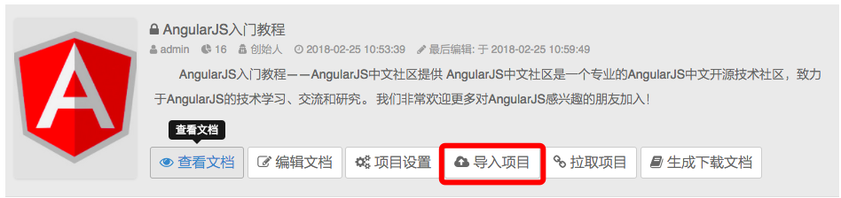
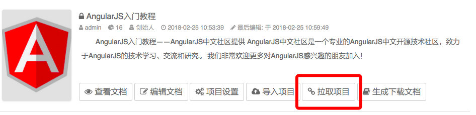
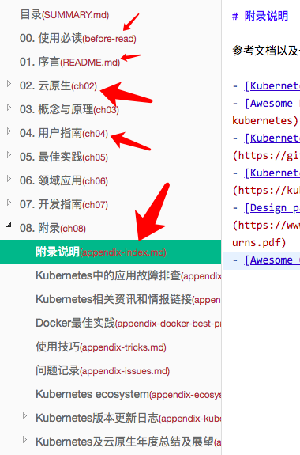
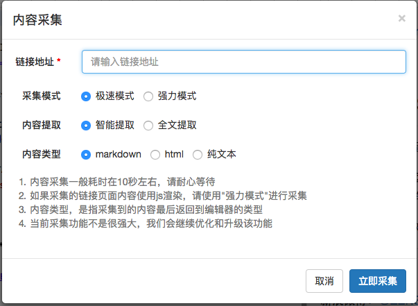
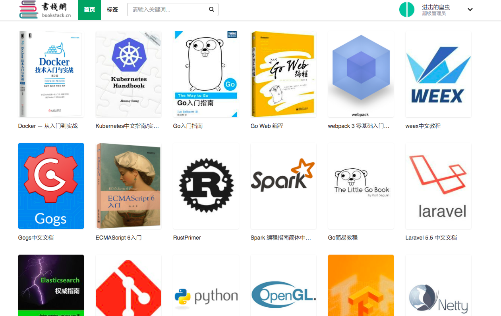
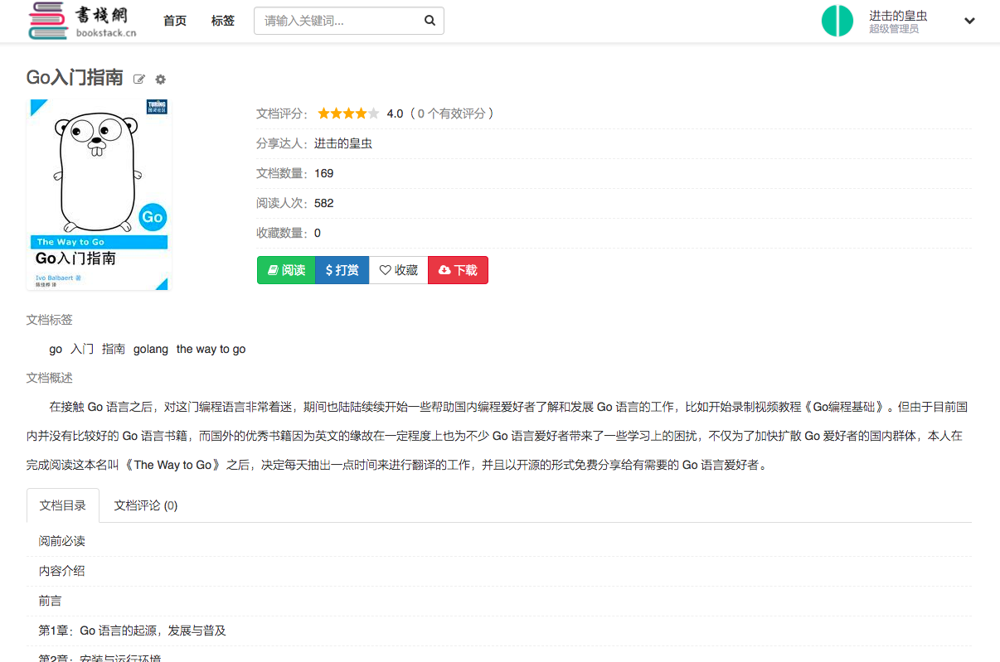
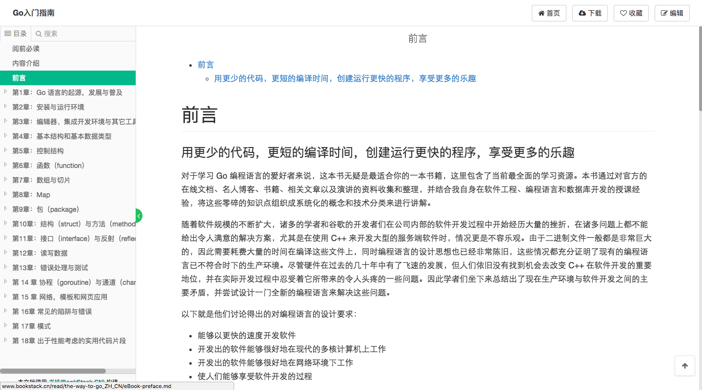
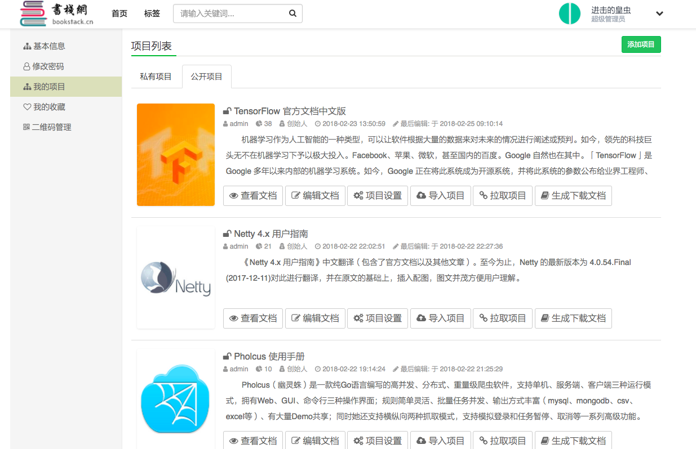
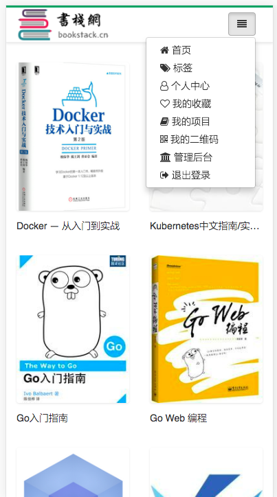

目录：
- [BookStack简介](#intro)
    - [开源](#open)
    - [QQ交流群](#qqgroup)
    - [站点](#site)
		- [演示站点](#demo)
		- [正式站点](#normal)
    - [更新、维护和升级](#upgrade)
    - [功能与亮点](#func)
		- [书籍分类](#cate)
		- [用户主页](#homepage)
		- [一键导入markdown项目](#import)
		- [一键拉取markdown项目](#pull)
		- [生成和导出PDF、epub、mobi等离线文档](#generate)
		- [文档排序和批量创建文档](#sort)
		- [文档间的跳转](#redirect)
		- [采集功能](#crawl)
		- [SEO](#seo)
		- [赞助二维码](#qrcode)
		- [更美观、简洁的页面布局和更为完善的移动端兼容](#beauty)
    - [TODO](#todo)
    - [安装与使用](#install)
    - [在开发的开源项目](#opening)
    - [待开发的开源项目](#to-open)
    - [关于本人](#aboutme)
    - [赞助我](#support)
		- [支付宝打赏赞助](#alipy)
		- [微信打赏赞助](#wxpay)
		- [捐赠列表](#supportlist)
    
<a name="intro"></a>
# BookStack 简介

BookStack，分享知识，共享智慧！知识，因分享，传承久远！

BookStack是基于[Mindoc](https://github.com/lifei6671/mindoc)开发的，为运营而生。

在开发的过程中，增加和移除了一些东西，目前已经不兼容MinDoc了（毕竟数据表结构、字段、索引都有了一些不同），同时只支持markdown编辑器。

目前v1.1版本已开发完成，实现了本地化存储的支持([升级日志](change.md))。本地化存储的支持，通过`app.conf`文件的`store_type`项来配置。

v1.0版本有很多地方不适于用于运营，使用v1.0版本的用户，建议升级到v1.1版本。关于升级，请看[安装与使用](#install)


> 关于BookStack使用文档难产：程序从v1.0开发升级到v1.1，满打满算用了一天的时间；而光写`readme.md`这个文档，当初就花了足足两天时间...会抽时间在开发v1.2版本前，把使用文档撰写出来，届时使用文档将发布在书栈网的[书栈(BookStack)使用手册](http://www.bookstack.cn/books/help)。

<a name="open"></a>
## 开源
两年前还在做PHP开发的时候，无意间遇到了Gitbook，以及看云，还有readthedoc。

当时想着自己也开发一套，但是后来没时间，当时也没那个技术积累。

后来学了Go语言，又在无意间遇到了[Mindoc](https://github.com/lifei6671/mindoc)，然后我们公司([掘金量化](https://www.myquant.cn) )也恰巧让我开发公司官网和文档系统，然后我就对[Mindoc](https://github.com/lifei6671/mindoc)做了二次开发。

本来是不想开源的，因为自己写代码的时候，写着写着，代码改来改去，然后代码就乱七八糟了，怕开源出来丢人现眼。但是踏入IT行业三年多时间以来，自身也受益于各种开源项目和开源组件，所以最终还是决定将BookStack开源出来。

其中肯定还是有不足的地方，大家在使用的过程中，遇到问题，欢迎反馈。

源码托管：
- Github: https://github.com/TruthHun/BookStack
- Gitee: https://gitee.com/truthhun/BookStack

<a name="qqgroup"></a>
## QQ交流群
为方便相互学习和交流，建了个QQ群，加群请备注`来自BookStack`

> QQ交流群：457803862(猿军团)

同时要说明的是，这个是学习交流群，如果是程序相关问题，请提交issue，再把issue链接发群里。

<a name="site"></a>
## 站点

<a name="demo"></a>
### 演示站点
[http://demo.bookstack.cn](http://demo.bookstack.cn)

有些功能，只有拥有管理员权限的用户才能使用，所以放出演示站点，欢迎大家随便玩。
管理员账号和密码如下（请大家不要更改密码，以方便大家体验，谢谢）：
```
账号：bookstack
密码：bookstack.cn
```
Tips:
- 如果管理员账号密码被修改，请在演示站点上注册一个账号，并把账号通过邮件发送给我，让我把你的账号设置成管理员。我的联系邮箱：TruthHun@QQ.COM
- 演示站点的第三方登录并未配置，注册账号时，请直接邮箱注册即可。

<a name="normal"></a>
### 正式站点
[http://www.bookstack.cn](http://www.bookstack.cn)

因为演示站点上的内容，大家在测试的时候，肯定是各种乱七八糟的什么内容都有，所以放出正式站点，给大家看下真正的效果。
还望大家不要在这个站点发一些乱七八糟的内容，毕竟这是正式站点，谢谢。

<a name="upgrade"></a>
## 更新、维护和升级
- 更新和升级日志，以后都写在这里==>[更新和升级日志](change.md)
- 本人会坚持平均每天抽出一小时用于开源程序的开发，您的支持、认可与鼓励比什么都重要

<a name="func"></a>
## 功能与亮点

<a name="cate"></a>
### 书籍分类(V1.2版本)
用户就像你的老板，他不知道自己需要什么，但是他知道自己不需要什么...

<a name="homepage"></a>
### 用户主页(V1.2版本)
在用户主页，展示用户分享的书籍、粉丝、关注和手册，增加用户间的互动

<a name="import"></a>
### 一键导入markdown项目
这个功能，相信是很多人的最爱了。目前这个功能仅对管理员开放。
> 经实测，目前已完美支持各种姿势写作的markdown项目的文档导入，能很好地处理文档间的链接以及文档中的图片链接



<a name="pull"></a>
### 一键拉取markdown项目
看到GitHub、Gitee等有很多开源文档的项目，但是一个一个去拷贝粘贴里面的markdown内容不现实。于是，做了这个一键拉取的功能。
目前只有管理员才有权限拉取，并没有对普通用户开放。要体验这个功能，请用管理员账号登录演示站点体验。
用法很简单，比如我们拉取beego的文档项目，在创建项目后，直接点击"拉取项目"，粘贴如" https://github.com/beego/beedoc/archive/master.zip "，然后就会自动帮你拉取上面的所有markdown文档并录入数据库，同时图片也会自动帮你更新到OSS。

> 经实测，目前已完美支持各种姿势写作的markdown项目的拉取，能很好地处理文档间的链接以及文档中的图片链接

<a name="generate"></a>
### 生成和导出PDF、epub、mobi等离线文档
这个需要安装和配置calibre。
我将calibre的使用专门封装成了一个工具，并编译成了二进制，源码、程序和使用说地址：[https://github.com/TruthHun/converter](https://github.com/TruthHun/converter)
在BookStack中，已经引入这个包了。使用的时候，点击"生成下载文档"即可

<a name="sort"></a>
### 文档排序和批量创建文档
很多时候，我们在写作文档项目的时候，会习惯地先把文档项目的章节目录结构创建出来，然后再慢慢写内容。
但是，文档项目中的文档少的时候，一个个去创建倒没什么，但是文档数量多了之后，简直就是虐待自己，排序的时候还要一个一个去拖拽进行排序，很麻烦。现在，这个问题已经解决了。如下：
- 在文档项目中，创建一个文档标识为`summary.md`的文档(大小写不敏感)
- 在文档中，填充无序列表的markdown内容，如：

```markdown
<bookstack-summary></bookstack-summary>
* [第0章. 前言]($ch0.md)
* [第1章. 修订记录]($ch1.md)
* [第2章. 如何贡献]($ch2.md)
* [第3章. Docker 简介]($ch3.md)
    * [什么是 Docker]($ch3.1.md)
    * [为什么要用 Docker]($ch3.2.md)
* [第4章. 基本概念]($ch4.md)
    * [镜像]($ch4.1.md)
    * [容器]($ch4.2.md)
    * [仓库]($ch4.3.md)
```
- 然后保存。保存成功之后，程序会帮你创建如"第0章. 前言"，并把文档标识设置为"ch0.md"，同时目录结构还按照你的这个来调整和排序。

注意：
> 必须要有`<bookstack-summary></bookstack-summary>`，这样是为了告诉程序，我这个`summary.md`的文档，是用来创建文档和对文档进行排序的。当然，排序完成之后，当前页面会刷新一遍，并且把`<bookstack-summary></bookstack-summary>`移除了。有时候，第一次排序并没有排序成功，再添加一次这个标签，程序会自动帮你再排序一次。
> 我自己也常用这种方式批量创建文档以及批量修改文档的标题


<a name="redirect"></a>
### 文档间的跳转
你在一个文档项目中会有很多文档，其中一个文档的文档标识叫`readme.md`,另外一个文档的文档标识叫`quickstart.md`，两个文档间如何跳转呢？
如果你知道站点的路由规则，倒是可以轻松链过去，但是，每次都要这样写，真的很麻烦。自己也经常写文档，简直受够了，然后想到了一个办法。如下：
我从`readme.md`跳转到`quickstart.md`，在`readme.md`中的内容这样写:
``` 
[快速开始]($quickstart.md)
```
如果跳转到`quickstart.md`的某个锚点呢？那就像下面这样写：
``` 
[快速开始-步骤三]($quickstart.md#step3)
```
好了，在发布文档的时候，文档就会根据路由规则以及你的文档标识去生成链接了(由于是后端去处理，所以在编辑文档的时候，前端展示的预览内容，暂时是无法跳转的)。
那么，问题就来了，我文档项目里面的文档越来越多，我怎么知道我要链接的那个文档的文档标识呢？不用担心，在markdown编辑器的左侧，括号里面的红色文字显示的就是你的文档标识。



<a name="crawl"></a>
### 采集功能
看到一篇很好的文章，但是文章里面有代码段、有图片，手工复制过来，格式全乱了，所以，相信采集功能，会是你需要的。采集功能，在markdown编辑器的功能栏上面，对，就是那个瓢虫图标，就是那个Bug，因为我找不到蜘蛛的图标...

功能见下图，具体体验，请到演示站点体验。




<a name="seo"></a>
### SEO
后台管理，个性化定制你的SEO关键字；并且在SEO管理这里，可以更新站点sitemap（暂时没做程序定时自动更新sitemap）

<a name="qrcode"></a>
### 赞助二维码
用户闲的蛋疼才会来你这里进行文档写作并给你生产内容...所以，要给用户画个饼——你来我这里进行文档写作，不但可以展示你的才华，还可以收到别人的打赏，而且，别人给你的打赏全都是直达你那里，没有`中奸商`赚差价。。。

<a name="beauty"></a>
### 更美观、简洁的页面布局和更为完善的移动端兼容
这是个看脸的时代...

> 首页



> 介绍页



> 内容阅读页



> 个人项目页



> 手机端首页




<a name="todo"></a>
## TODO
- 文档阅读书签
- 微信第三方登录
- 微博第三方登录
- 收费下载和收费阅读(放在最后开发)
- 签到功能
- 增加广告位和广告管理
- 积分功能
- 除了数据库配置项外，其余配置项尽可能在管理后台可配置
- 增强搜索功能，上elasticsearch
- 简化程序部署，上docker
- 微信小程序(放到2.x版本开发)
- 版本管理 ？(待找到更优解决方案了再实现)
- 使用weex开发手机端APP ? (vue.js熟练了再抽时间实现)
- 使用electron开发桌面端，实现类似网易`有道云笔记`的功能 ? (vue.js熟练了再抽时间实现)

Tips:
> 更多功能，期待您的想象力，然后通过issue向我提出来，或者到HC-CMS(http://www.hc-cms.com) 发帖提出


<a name="install"></a>
## 安装与使用


为了方便，安装和使用教程，请移步到这里：http://www.bookstack.cn/read/help/Ubuntu.md
> 目前只写了Ubuntu下的安装教程，Windows下的安装和使用教程，暂时没时间

有两个模板文件，需要手动修改下：
`/views/widgets/pdf_footer.html` 导出PDF文档时，pdf的footer显示内容
`/views/document/tpl_statement.html` 修改成你想要的文案内容或者删除该文件。如果保留该文件，必须要有`h1`标签，因为程序要提取你的`h1`标签用于导出文档的目录生成

默认的管理员账号密码均是`admin`

> `v1.0`升级到`v1.1`,直接下载对应系统的发行版本，然后根据配置文件的配置提示修改配置文件，然后覆盖升级即可。本次升级，没有改动数据库。

关于二次开发，请看这个issue [README.md中能否添源码编译说明](https://github.com/TruthHun/BookStack/issues/3)


<a name="opening"></a>
## 在开发的开源项目
- wenku.it IT文库，地址：http://wenku.it （半成品）
- ApiServ.me API服务，地址：http://apiserv.me (半成品)
- BookStack 无库版(不需要数据库)，地址：https://github.com/BookStackCN/BookStack （半成品）

<a name="to-open"></a>
## 待开发的开源项目
- NetDisk.ME 网盘项目，"抄袭"百度网盘和腾讯微云
- OneHourADay.CN 每天一小时（微信小程序）

<a name="aboutme"></a>
## 关于本人
2014年7月本科"毕业"踏入IT行业；Web全栈工程师；什么都懂一点，什么都不精通。


<a name="support"></a>
## 赞助我
如果我的努力值得你的肯定，请赞助我，让我在开源的路上，做更好，走更远。
赞助我的方式包括：`支付宝打赏`、`微信打赏`、`给BookStack一个star`、`向我反馈意见和建议`

> 对我进行打赏赞助的朋友，麻烦在赞助的时候留一下你的姓名或者昵称，感谢。

<a name="alipay"></a>
### 支付宝打赏赞助


<a name="wxpay"></a>
### 微信打赏赞助


<a name="supportlist"></a>
### 捐赠列表
 
|  赞助时间 | 赞助人  | 赞助金额  |  附言  | 答复 |
| ------------ | ------------ | ------------ | ------------ | ------------ |
| 2018-05-22   | `*英`  | 10.00(微信)  | --  | 感谢支持  |
| 2018-05-21   | `Tony`  | 10.00(支付宝)  | 赞助书栈  | 谢谢。会努力把开源项目做好  |
| 2018-05-19   | `*丘`  | 16.66(微信)  | BookStack well done  | 感谢认可  |
| 2018-05-15   | `*佬`  | 1.00(微信)  | -  | 感谢对开源的支持  |
| 2018-05-10   | `图样图森破`  | 5.00(支付宝)  | -  | 感谢对开源的支持  |
| 2018-04-28   | `*)`  | 15.00(微信)  | -  | 感谢对开源的支持 |
| 2018-04-22   | `*弗`  | 15.00(微信)  | -  | 谢谢对开源的支持，会坚持把开源做好  |
| 2018-04-20   | `信仰的虫子`  | 10.00(码云-支付宝)  | 感谢您的开源项目！  | 感谢！ |
| 2018-04-20   | `D*m`  | 10.00(微信)  | 完美  | 没有最好，只有更好。做不到完美，但是会争取做得更好。谢谢支持。  |
| 2018-04-17   | `*刘`  | 11.00(微信)  | 他们才给10块  | 每个人都在为开源献上自己力所能及的力量。感谢支持。 |
| 2018-04-15   | [南宁引力互动科技](http://www.gxyinli.com/)  | 6666.66(支付宝)  | 支持开源  | 感谢好基友的支持，祝创业成功  |
| 2018-03-07   | `*客`  | 10.00(微信)  | 加油  | 非常感谢支持，你们的认可是我最大的动力  |
| 2018-03-05   | `金飞`  | 10.00(支付宝)  | 很赞的BookStack开源项目，加油！  | 感谢！希望这个项目能帮到更多人  |
| 2018-03-05   | `安典`  | 10.00(微信)  | 保密  | 感谢支持和认可  |
| 2018-03-04   | `戴宝明`  | 10.00(微信)  | 保密  | 根据手机号码找不到微信号...  |
